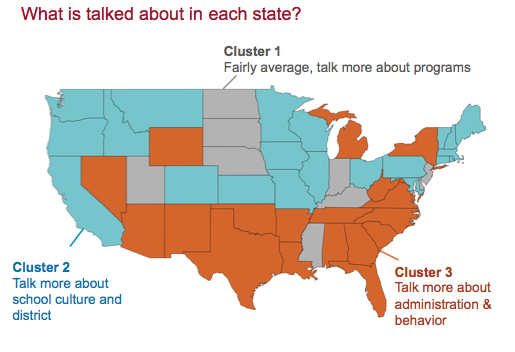
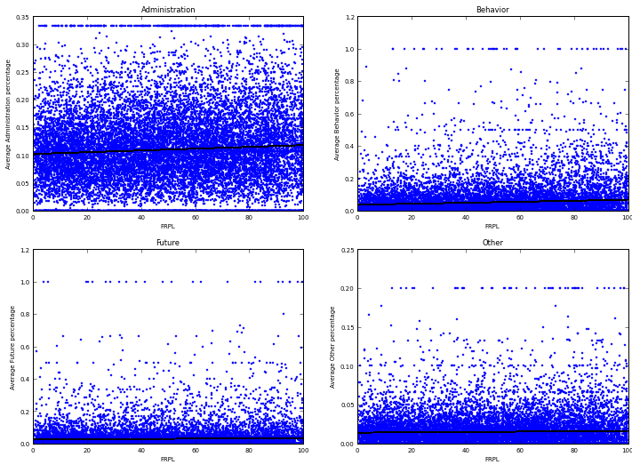

This project analyzes data from the nearly one million ratings and reviews submitted to GreatSchools, the largest online review site for schools in the world. We want to understand whether reviews contain information that may be useful for either parents or policymakers. We also want to understand the types of pressures that different schools may face if parents respond to online reviews in their school choices and online reviews serve as a form of crowd-sourced accountability.

You can find a much more detailed discussion of our methods and findings [here](https://sites.google.com/site/cs109greatschools/?invite=CNHf3egM) and complete code on my github. Unfortunately, I cannot share the data used as it is proprietory and under our licensing agreement was erased following the project.

# Background

GreatSchools is the largest school review website in the country.  It has over 1 million reviews that are used by over half of U.S. families. Reviews include both stars and text information by students, parents, and school staff.

# Data Collection and Management

We asked GreatSchools if they would share with us all of the more than 1 milllion reviews ever written.  They generously did, together with tens of millions of test results and census records. 

The GS data was inherently relational and required a centralized, structured and secure repository. MySQL was selected for this purpose, and was run on Amazon Web Services' Relational Data Server.  After scaling the database several times, we ultimately used an AWS m1.large server with 2 processors and 7GB RAM.  

The pymysql library and psql were used to create a class for managing MySQL database connections and retrieving denormalized rows of school, reviews, test results and census data via execution of stored procedures on the AWS/RDS MySQL db. This permitted quick delivery of rows that loaded smoothly into Python panda datasets.  

Table fields and data types are given in the model below.

# Modeling Topics Using Latent Dirichlet Allocation (LDA)

## Text Processing

Text processing was done using Pythons’s Natural Language Toolkit (NLTK) and iPython clustering. GreatSchools reviews were ingested from the database, scattered to multiple ipython worker nodes, processed and finally merged back together into one text.

During the course of working on the project, the order of operations being performed in the text pipeline changed. There are many ways in which the operations can be combined, and most orderings involve a trade-off between performance and extracting the cleanest text. Ultimately, we performed the following steps in the oder given below:
<ol> 
<li><i>Remove encodings</i>: The text contained various escape character sequences and HTML encodings that needed to be removed, as not all the functions being used in text processing could handle them.</li>
<li><i>Tokenize sentences and words</i>:using the NLTK sentence and word tokenizers.</li>
<li><i>Spelling correction</i>: using the Enchant spell correction library from Abiword and its python helper library pyenchant.</li> 
<li><i>Part of Speech Tagging</i>:using NLTK’s Treebank maximum entropy classifier based pos tagger. Most topic models are built using nouns as they are most representative of concrete topics. Although adjectives, verbs and other parts of speech can add interesting context, they generally overpower the underlying nouns and can inject sentiment. We were not using the words to classify sentiment, so only nouns were of interest. Only nouns were further passed on in the pipeline.</li> 
<li><i>Remove punctuation and short words</i>: that is, words less than three characters.</li>
<li><i>Make all words lowercase</i></li>
<li><i>Remove stopwords</i>: The stop words started with a list of common English stop words from the NLTK stopword corpus. Additional words were manually added to create a custom_stopset, which we used to stop against all unigrams.</li>
<li><i>Lemmatize Words</i>: using NLTK’s WordNet Lemmatizer. This reduces the dimension of the data by aggregating words that either are the same root or have the same meaning. The lemmatizer uses the pos tags to understand what words might be synonyms. Other techniques were looked at such as stemming, but lemmatization appeared to be superior for our purpose, as we wanted to make sure the words that were used were actual words humans would understand, and stemmers can aggressively mangle words.</li>
</ol>

## Fitting LDA Model

Various models were considered and experimented with using a variety of tools. In python LSI, LDA and HDP were all experimented with. Ultimately we chose to work with the gensim implementation of LDA. 

LDA operates over a bag of words (bow). The bow is created from first creating a dictionary of our final processed text, and then passing the text to the dictionary to create a bow. Our dictionary was created from the output of our text processing. After the dictionary was created, we removed infrequent and frequent words by using the dictionary.filter_extremes() method. We removed all words that did not appear in at least 5 documents, removed all words that appeared in more than 60% of the documents.

The LDA model was built using 75 topics. A grid search was ran across multiple topic numbers and an ideal value for number of topics was chosen which had a low perplexity. The team members further validated the number of topics by looking at the results of various models built from various numbers of topics and choosing the one that looked best. Grid searches were also conducted for hyper parameters alpha and eta, once again measuring perplexity. It was found that the default parameters were reasonable. Default alpha andeta are 1/num_topics.
Gensim’s distributed architecture

Gensim uses the Pyro4 framework to allow for distributed parallel processing of LDA jobs. The corpus is divided into chunks, and each worker is assigned a chunk. Since we were working with 32 cores, we used 32 workers over which the entire corpus was divided. Gensim handled all of the sharding and merging of the data.

Using blind review by two team members, then verification by all team members, we classified the 75 topics into 8 categories and 30 subcategories.

# Descriptive Analysis

## Overview

Looking at the topics we have identified using LDA, the largest proportion of reviews talked about school administration - principals, staff, teachers, policies and organization.  The next segment was about school programs, both curricular and extra curricular.  The third most common review topic was school culture.

## Change in Key Words

We begin by looking at how the prevelance of particular words has changed over time.

Mentions of "safety" initially decline, with a bump in 2007, and now appearing to be on the increase again, possibly instigated by recent school shootings.

With the Great Recession, budget and funding has been on the minds of policymakers and citizens alike.  Surprisingly, reviews mentioning "budget" declined during the stock market boom of 2005-7, but did not rise immediately at the market crash.  It appears to be a lag indicator of stock market declines.

Looking at individual reviews sparked interest in how people viewed Spanish as a foreign language and latin immigrants.  Surprisingly, plotting the word trend revealed an eerily close correlation between reviews mentioning "spanish" and the stock market.  While not causal, and possibly spurious, there may be underlying mechanisms that could be worth exploring in a future project.

Bullying and teen suicides are on the forefront of social issues confronting schools at the moment.  The peak of reviews mentioning "bully" correlates with Google trends for web searches in the U.S.  The rise in 2011 may have been instigated by teen suicides and Obama addressing bullying victims.

## Location

We began by plotting a point for every school in the country, colored according to the star rating. This plot did not indicate any difference between rural schools and urban centers or across regions. However, having so many tops on top of each other may have been hiding patterns.

Topics were averaged within each state, then clustered by k-means.  Skree-type plot was used to select number of clusters. We found three groups of states when it came to reviews.  Reviews in the first group talked more about academic and extracurricular programs relative to other states.  Reviews in the second group discussed school culture and environment more than other states.  The last group of states had more reviews about school administration and student behavior than other states.

## Reviewer Type

Staff, administrators, and teachers have varying levels of reviews for schools.  But principals are very different from the rest of school staff.

Although students and parents have different goals and objectives when it comes to schools, the apple does not fall too far from the tree. Students and parents have similar levels of liking and criticism for schools.

# Regression Analysis

## Bayesian Model

We use a hierarchical Bayesian multinomial logit regression model to examine the relationship between multiple explanatory variables and the topics discussed in a review. Since multinomial logit estimate procedures typically require the independent variable to be categorical, we customize a procedure based on functions in the  RR  package  bayesmbayesm . We use Metropolis algorithm to draw from the posterior distribution.

The dependent variable is the topic discussed in a review, estimated from an LDA.  Topics vary from 0 to 1 across a number of topics; the sum of topics for any given review is Although the variable is not multinomial, its resemblance allows us to use multinomial logit regression to estimate how topic distribution changes with independent variables.

The independent variables are:
<ul><li>School tests, normalized across states
<li>Poverty, as measured by the percent of students enrolled in free or discounted school lunches
<li>Charter schools, relative to public schools.
</ul>

Because private schools are not compelled to share test results or lunch program enrollments, we excluded them from this analysis.

## School Type

Charter school reviews are significantly more likely than public schools to discuss student behavior, student futures, and academic and extracurricular activities. 

## School Performance

### Measuring School Performance

Since the passage of No Child Left Behind (NCLB) in 2001, states have been required to test the proficiency of students in public schools in grades 3-8 and to make these results publicly available at the school level. However, as NCLB left it for each state to design and modify the examinations sat by its students, there is considerable variation in the difficulty of examinations across both states and years (for example, see [Peterson, Barrows, and Gift 2016](http://educationnext.org/after-common-core-states-set-rigorous-standards/)).

At the time of our analysis, no measure existed that allowed for the comparison of school performance nationwide. We therefore contructed the first such measure. [Greene and McGee](http://globalreportcard.org/docs/AboutTheIndex/Global-Report-Card-Technical-Appendix-9-28-11.pdf) have constructed a nationally comparable measure of performance at the school district level. We followed their methodology, but applying it at the school level for the first time and focusing on the proportionof students in a school achieving the proficiency cut score or better in Mathematics in Grade 4 in a given year. 

### Relationship Between Performance and Topics

Schools with better test scores are more likely to have reviews about student future and programs relative to behavior, but only in certain states (7 out of 14 states examined). Further, the relationship between school performance and school topics is weak, as becomes apparent if we plot topic proportions against performance, for example (note that this plot is not based on the model that we fitted):  

## Poverty

Poverty also steers the topics to more "behavior" subjects rather than student future, but only in six states (GA, MD, MI, NY, TX). Again, the relationship between poverty and review topics is weak; for example:

# Conclusions

Great schools reviews to contain information that amy be useful to policymakers..... The different topics discussed in school reviews also suggest that, to the extent that parents or school pay attention to school reviews, different types of schools with different characteristics may face different types of pressures from this new form of accountability.

We also find, however, that the relationship between school characteristics and the topics discussed in reviews is relatively week. In other words, at the the individual school level, school reviews do not appear to be a particularly useful predictor of school characteristics. This is hardly surprising, given the sparsity of school reviews. It strongly suggests, however, that parents should exericse caution in putting much weight on school reviews in making school choices.

